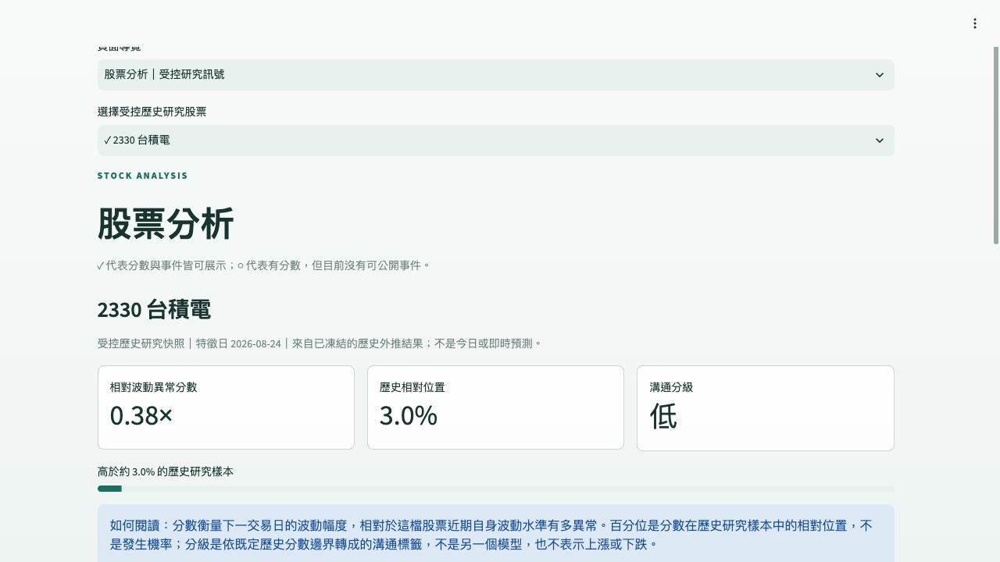

# Financial AI Assistant

**Independent ML & Financial NLP Research Project**

Forecasting next-session volatility surprise relative to each stock's own historical context,
with a separate financial-event intelligence track.

**v1.0 research: complete and frozen** · [v1.0.0-portfolio release](https://github.com/mieuxwei/financial-ai-assistant/releases/tag/v1.0.0-portfolio)

> **Controlled Research Demo.** The public app displays frozen historical out-of-fold (OOF)
> snapshots and permitted derived event metadata—not synthetic market data, live prices/news,
> or request-time model inference. It does not predict price direction, returns, or target prices,
> and is not investment advice.
>
> **繁中摘要：**獨立 ML 與金融 NLP 研究專案。v1.0 研究已完成並凍結；公開展示使用受控歷史快照。
> 研究的是下一交易日相對於個股自身歷史水準的波動異常程度，不預測漲跌。

[**Open Live Demo**](https://mieuxwei-f6rbk4pvtvxs3rsh3k2zmn.streamlit.app/)
· [完整中文總覽](docs/project_overview_status_and_technology.md)
· [Research results](#research-results)
· [Run locally](#run-locally)
· [Evidence index](#evidence-index)

The free-hosted demo may sleep after inactivity. If Streamlit shows a sleep page, use its wake
button and allow time for startup. The screenshot below is a fallback; no keep-alive service is used.



Screenshot: actual local presentation capture using the frozen historical evidence, not a
generated dashboard. The public app may briefly show an earlier layout during deployment updates.

## Research results

The two tracks answer different questions under different evaluation protocols. Their Spearman
values **must not be compared as a head-to-head model ranking**.

| Study | Historical evaluation scope | Key result | Supported interpretation |
|---|---|---|---|
| **Track A · stock-normalized volatility surprise** | 10 instruments; 20,637 unique historical OOS rows; 7 rolling-origin outer periods | Ridge: mean outer Spearman **0.1940**, MAE **0.5473**, top-decile lift **1.3542** | Modest historical ranking signal; R² near zero/slightly negative, not precise magnitude prediction |
| **Track B · market-reaction magnitude** | 7,582 events; 3,433 reaction windows; 9 tickers; chronological OOF | Metadata-only: OOF Spearman **0.2504**, top-decile lift **1.623** | Automated historical-association signal, not direction or causal impact |

**成果摘要：**Track A 支持有限的歷史排序資訊；Track B 支持事件 metadata 與後續反應幅度的歷史關聯。
BERT 文字未提供穩健的方向預測增益，中文情緒仍未通過獨立驗證。


Ridge and HistGradientBoosting fall within the predeclared **0.01 Spearman practical-tie margin**.
Ridge was selected by the frozen lower-mean-MAE tie-break, with final **alpha = 100**.
HGB's stronger worst-fold Spearman and slightly higher decile lift remain in the
[model-selection evidence](research/evaluation/f7_final_research_model_result.md); this is not a claim
of universal superiority.

## Research question and method

> Can price, volume, volatility and market-context features available at the information cutoff
> forecast next-session volatility surprise relative to a stock's own historical volatility?

The primary target is the next-session adjusted-close absolute log return divided by the
20-session stock-volatility estimate known at feature session `t`. The frozen contract contains
23 features; predictors never read the future target.

- Expanding historical outer periods, with inner temporal model selection contained in each
  outer training history.
- Fold-local preprocessing; no random train/test split or globally fitted scaler.
- Regression errors, ranking, decile analysis and ticker/time/regime robustness.
- Dataset, configuration and artifact hashes preserve reproducibility and source lineage.

The original binary HIGH_RISK/NORMAL study exposed threshold and regime sensitivity.
Conditional analysis supported the more stable stock-relative outcome, motivating continuous
forecasting. That exploratory evidence is preserved in the
[research migration map](docs/final_study_migration.md), not deleted.

This is a **retrospective, leakage-aware, hypothesis-informed study**. Earlier historical work
informed the problem formulation; the final evaluation is neither a pristine untouched holdout
nor prospective or independent external validation.

## Public demo and system architecture

Five boundaries remain separate:

| Capability | Status |
|---|---|
| v1.0 ML/NLP research | **Complete / frozen** |
| Public historical Web Demo | **Established controlled demonstration**; Streamlit is the primary entry |
| LINE / Google Apps Script | **Experimental multi-channel integration**; optional, not required to use the demo |
| Current-market model serving | **Disabled**; exact feature parity **5/23**, readiness gates **6/9** |
| Official forward collection | **Deployed for future external validation**; collection does not retrain or establish validation results |

The demo supports stock selection, historical score/percentile/band explanation, event intelligence,
and up to five session-only demo holdings. Ten tickers have their own Track A snapshots; nine have
permitted event summaries. **0050 has no public event evidence and is not filled with another
ticker's event.** There is no current valuation, ROI, or profit/loss calculation.


- **Public runtime:** Browser → Streamlit → committed historical evidence and session state.
  No FastAPI, database, provider, private model artifact, or runtime secret is required.
- **Research/API:** offline data and ML/NLP pipelines → frozen artifacts → versioned FastAPI
  contracts. These do not run inside the public dashboard request path.
- **Experimental messaging:** LINE OA → Cloudflare signature-verification edge → GAS
  routing/Flex rendering → FastAPI on Vercel → isolated PostgreSQL/Neon sandbox.
- **Future evidence:** GitHub Actions → TWSE/TPEx official feeds → private immutable Cloudflare
  R2 archive. This is not an inference or automatic-retraining path.

**狀態摘要：**Web 是主要公開入口；LINE/GAS 保留為工程原型。即時推論維持停用，未來外部驗證不影響
已完成的 v1.0 研究，也不代表已取得外部驗證成果。

## Run locally

Python 3.12 and Git are required.

```bash
python3.12 -m venv .venv
source .venv/bin/activate
python -m pip install -e ".[dev,demo]"
python -m streamlit run demo/public_app.py
```

The public demo uses committed, public-safe historical evidence. It needs no `.env`, provider key,
private data download, or model-training step. Example holding amounts/costs are demo inputs,
not market observations.

Optional local API foundation:

```bash
python -m uvicorn backend.app.main:app --reload
curl http://127.0.0.1:8000/health
```

Validation:

```bash
python -m pytest -q
python -m ruff check .
python scripts/check_secrets.py
git diff --check
```

Private/licensed raw data and local training artifacts are intentionally excluded. Code, frozen
protocols, aggregate results and safe demo evidence are public; full historical reproduction may
require separately authorized source data. Do not interpret the runnable demo as a full retraining
bundle.

## Evidence index

| Topic | Source |
|---|---|
| Full Traditional Chinese overview | [專案介紹、狀態與技術](docs/project_overview_status_and_technology.md) |
| Target, features and evaluation rules | [Final study protocol](docs/final_volatility_surprise_study_protocol.md) |
| Track A temporal evaluation | [Outer/inner evaluation](research/evaluation/f5_nested_temporal_evaluation_result.md) |
| Ranking and robustness | [Deciles and subgroup evidence](research/evaluation/f6_ranking_robustness_result.md) |
| Frozen model decision | [Ridge selection and artifact contract](research/evaluation/f7_final_research_model_result.md) |
| Track B reaction study | [Market-reaction evidence](research/evaluation/b4_market_reaction_validation_result.md) |
| NLP integration | [Separate capabilities and abstention](research/evaluation/b5_nlp_intelligence_integration_result.md) |
| Current serving limitation | [Official-source parity audit](research/evaluation/f11b_official_current_market_parity_result.md) |
| Public deployment | [Web demo architecture and operation](docs/public_web_demo_release.md) |
| Experimental LINE | [Security, GAS and sandbox architecture](docs/line_public_beta_architecture.md) |
| Forward archive | [Collection deployment and lifecycle](docs/forward_collection_deployment.md) |
| v1.0 release audit | [Historical validation record](docs/final_release_audit.md) |

Historical milestone reports describe their state **at the time of the experiment**.
Detailed development records remain under `docs/internal/`; they are not new release requirements.

## Limitations and data rights

- Historical ranking signal is limited; the ten-instrument universe and temporally concentrated
  exclusions restrict generalization.
- Event class, reaction magnitude, media tone and linguistic sentiment are distinct. Chinese P/N/N
  sentiment remains **abstained**, and FSC-adapted BERT is a representation artifact, not a validated
  direction predictor.
- Official current-price coverage does not establish adjusted-price or training/serving parity.
  **5/23 features and 6/9 gates are insufficient**; current inference remains disabled.
- Public event summaries use permitted derived metadata—not licensed titles, full text or bulk raw
  TWMD records. Private holdings, screenshots, credentials and GAS originals are excluded.
- No repository-wide source-code license has been granted. Public visibility does not imply
  permission to reuse the code; third-party data retain their original licensing boundaries.

**限制摘要：**不預測漲跌、不提供投資建議、不宣稱因果；中文情緒拒絕未驗證判定，即時推論不繞過
特徵一致性門檻。資料來源與程式碼各自保留權利邊界。

## Future external validation

The deployed TWSE/TPEx forward collector preserves raw-first evidence, normalized versions,
SHA-256 lineage and idempotent run manifests in private R2 storage. Naturally future observations
may support a separately approved v1.1 external-validation study after sufficient data accumulate.

**Scheduled collection ≠ automatic retraining ≠ completed external validation.**
The completed `v1.0.0-portfolio` research remains unchanged.
