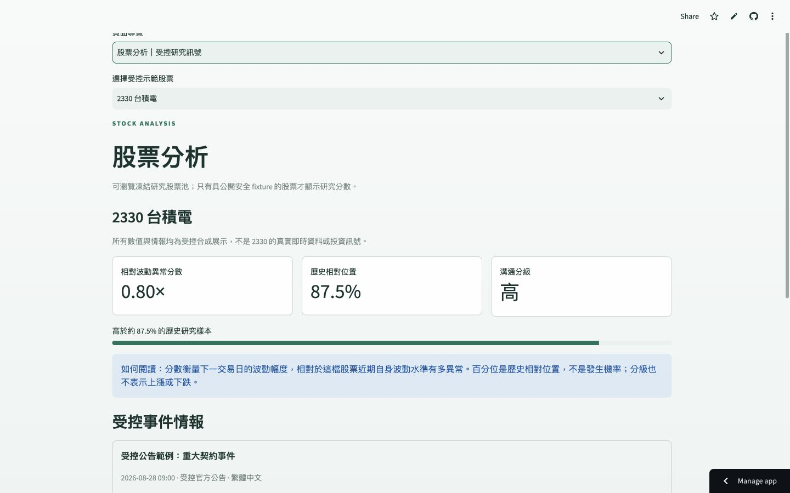
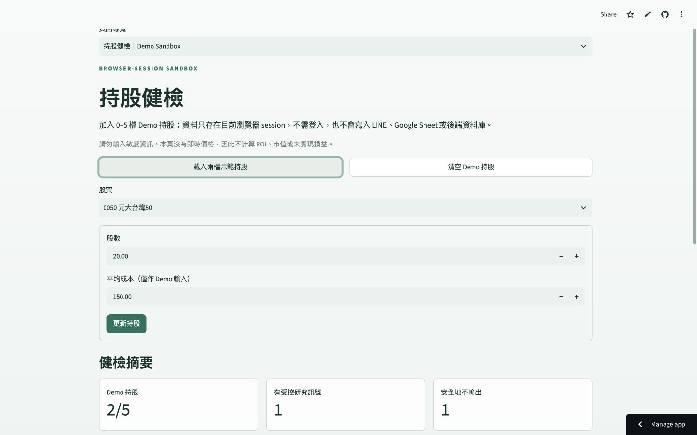
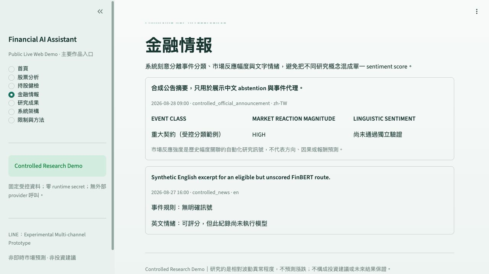

# Financial AI Assistant

**基於機器學習之股票相對波動異常程度預測與金融 NLP 情報系統**

一套研究導向的台股 Financial Intelligence Assistant。專案以 leakage-safe 的價格、成交量、
波動與市場情境特徵，預測下一交易日相對於個股自身歷史水準的波動異常程度；另一條 NLP
研究線則提供事件分類與歷史市場反應幅度情報。

**Primary public experience：**
[開啟 Public Live Web Demo](https://mieuxwei-f6rbk4pvtvxs3rsh3k2zmn.streamlit.app/)

> **Controlled Research Demo**：公開網站使用已凍結、ticker-specific 的歷史研究快照，
> 不是即時市場推論、漲跌預測或投資建議。


## Problem

短期價格方向高度雜訊化，而同一個絕對漲跌幅對高波動與低波動股票的意義也不同。本研究因此
不預測上漲或下跌，而是研究：能否在嚴格時間切分下，預測下一交易日相對於該股票自身近期
波動背景的異常程度？

## Research question

> Can leakage-safe price, volume, volatility and market-context features forecast next-session
> volatility surprise relative to each stock's own historical volatility context?

主要 target 為下一交易日 adjusted-close 絕對 log return，除以 feature session `t` 當下可知的
20-session 個股歷史波動。所有 predictors 僅使用資訊截止時間以前的資料。

## What the system does

- **股票分析：**顯示受控歷史 volatility-surprise score、歷史百分位與溝通分級。
- **持股健檢：**在瀏覽器 session 中管理最多五檔 Demo holdings，整合研究快照與事件情報。
- **金融情報：**分開呈現事件類型、歷史市場反應幅度與語言情緒的驗證狀態。
- **研究與工程展示：**呈現 rolling-origin 評估、FastAPI contracts、資料管線、安全邊界與
  experimental LINE/GAS integration。

公開 Demo 不計算即時 ROI、不呼叫外部 provider，也不保存使用者持股。

## Method

研究最初探索二元 `HIGH_RISK / NORMAL` 分類。門檻與波動 regime 敏感度、以及 conditioned
analysis 的 Simpson-type composition effect 顯示，較穩定的問題定義是連續的 stock-relative
volatility surprise。舊二元研究完整保留為問題形成證據，最終模型則以以下程序評估：

1. 十檔固定台股 universe 與 TAIEX benchmark 對齊；
2. 所有 rolling features 僅使用 `t` 以前資訊；
3. 七個 chronological rolling-origin outer periods；
4. 每個 outer training history 內再做 temporal model selection；
5. preprocessing 僅在當下 training fold 重新擬合；
6. 以 regression error、Spearman ranking、decile lift 與 subgroup robustness 評估。

這是 **retrospective、leakage-aware、hypothesis-informed** 研究，不是 pristine holdout、
prospective validation 或獨立外部驗證。

## Data

- 10 檔固定台股／ETF，40,691 筆個股歷史 OHLCV rows；
- 4,080 個 TAIEX benchmark sessions；
- 32,357 筆符合 frozen target/feature contract 的 final rows；
- 20,637 筆 unique historical out-of-sample evaluation rows；
- Track B 私有授權來源研究包含 7,582 events，聚合為 3,433 個 reaction windows、涵蓋九檔。

歷史市場資料、官方事件資料與授權來源各自保留來源、時間、版本與 hash lineage。私人 raw
資料、文章全文、持股與 credentials 不進入公開 repository。

## Results

### Track A — volatility-surprise forecasting


| model | mean outer Spearman | mean outer MAE | worst-fold Spearman | top-decile lift |
|---|---:|---:|---:|---:|
| Persistence | 0.0608 | 0.7274 | 0.0080 | 1.1766 |
| Ridge | **0.1940** | **0.5473** | 0.1091 | 1.3542 |
| HistGradientBoosting | 0.1863 | 0.5480 | **0.1349** | **1.3611** |

Ridge 與 HGB 落在預先凍結的 0.01 Spearman practical-tie margin 內；Ridge 因 mean outer MAE
較低而依規則選出，最終 `alpha=100`。平均 R² 接近零／略為負值，因此結論是 **modest
historical ranking signal**，不是精準的未來振幅預測。


### Track B — Financial NLP Intelligence

Track B 刻意將 linguistic sentiment、event class、market-reaction magnitude、financial-domain
representation 與 media tone 分開：

- Metadata-only absolute-reaction model：OOF Spearman **0.2504**、top-decile lift **1.623**；
- maturity 僅為 automated historical-association signal，不代表方向或因果；
- signed reaction 的 evidence 弱，BERT text 對 metadata baseline 沒有 supported incremental
  value；
- FSC-adapted BERT 保留為 financial-domain representation，不能宣稱改善報酬預測；
- 中文 linguistic sentiment 未取得獨立有效驗證，因此不輸出 Positive/Neutral/Negative
  機率；
- eLAND 排除於 active modeling，只保留資料稽核與拒絕證據。

## Public Demo

Production URL：<https://mieuxwei-f6rbk4pvtvxs3rsh3k2zmn.streamlit.app/>

- 部署於 Streamlit Community Cloud；
- 使用十檔 ticker-specific Track A 受控歷史快照；
- 九檔具有 public-safe、metadata-derived event summary，0050 明確 fail closed；
- browser-session portfolio 不登入、不持久化，最多五檔；
- zero runtime secret、zero request-time provider call；
- 不載入私人 model/data artifact，不執行 current-market inference。





## Architecture


```text
Primary portfolio path
Browser → Streamlit → controlled historical evidence + browser-session portfolio

Research/API path
Market and event pipelines → ML/NLP research → FastAPI versioned contracts

Experimental messaging path
LINE OA → Cloudflare security edge → Google Apps Script → FastAPI → PostgreSQL sandbox

Future validation path
GitHub Actions → official TWSE/TPEx feeds → private Cloudflare R2 archive
```

Streamlit 是主要公開體驗。LINE/GAS 保留為多通路、安全 webhook、HMAC identity、idempotency
與使用者隔離的工程原型，不是使用專案的必要入口。

## Repository structure

| path | purpose |
|---|---|
| `demo/` | Streamlit controlled public experience and public-safe fixtures |
| `backend/` | FastAPI application, schemas, services and persistence boundaries |
| `pipelines/` | market, news, feature, sentiment and intelligence pipelines |
| `research/` | frozen configs, model code and evaluation evidence |
| `jobs/` | reproducible CLI entry points |
| `line_adapter/` | experimental public-beta GAS frontend source |
| `security_edge/` | LINE raw-signature verification edge |
| `docs/` | architecture, methodology, deployment and limitations |
| `tests/` | unit and integration regression suite |

Historical milestone and internal development records are archived under `docs/internal/` and are
not the public entry point.

## Run locally

Requirements: Python 3.12 and Git.

```bash
python3.12 -m venv .venv
source .venv/bin/activate
python -m pip install --upgrade pip
python -m pip install -e ".[dev,demo]"
```

Run the public-safe dashboard:

```bash
python -m streamlit run demo/public_app.py
```

Run the local FastAPI foundation:

```bash
python -m uvicorn backend.app.main:app --reload
curl http://127.0.0.1:8000/health
```

Validation:

```bash
python -m pytest -q
ruff check .
python scripts/check_secrets.py
git diff --check
```

## Limitations

- Track A 支持 historical ranking 的程度高於 exact magnitude prediction；不預測價格方向。
- 十檔 universe 與具年份集中的 coverage exclusions 限制泛化能力。
- Track B reaction magnitude 是 observational association，不是 causal impact。
- 中文 sentiment 尚未通過獨立驗證，系統以 abstention 保護 claim boundary。
- Current-market serving 保持 disabled：官方 current OHLCV 雖涵蓋 10/10，但 training/serving
  exact feature parity 僅 5/23，整體 gate 6/9。
- 公開 Demo 是歷史受控展示，不是交易系統或投資建議。

## Future External Validation

已部署的 private forward collector 每日三次擷取 TWSE／TPEx 官方重大訊息，使用 raw-first、
immutable manifests、SHA-256 lineage 與 same-run idempotency 保存自然形成的未來證據。資料收集
**不會自動重訓或驗證模型**。累積約 3–6 個月後，可另開 v1.1 research milestone，以真正 unseen
future observations 評估 frozen v1.0。

## Documentation

- [Portfolio guide](docs/portfolio_finalization.md)
- [Architecture](docs/architecture.md)
- [Final study protocol](docs/final_volatility_surprise_study_protocol.md)
- [Temporal evaluation result](research/evaluation/f5_nested_temporal_evaluation_result.md)
- [Ranking and robustness result](research/evaluation/f6_ranking_robustness_result.md)
- [Final model result](research/evaluation/f7_final_research_model_result.md)
- [NLP integration result](research/evaluation/b5_nlp_intelligence_integration_result.md)
- [Public Web Demo release](docs/public_web_demo_release.md)
- [Forward collection deployment](docs/forward_collection_deployment.md)
- [Privacy boundary](docs/privacy.md)
- [Final release audit](docs/final_release_audit.md)

## License and data rights

No repository-wide source-code license has been granted; public visibility does not imply permission
to reuse the code. Third-party market, benchmark, publisher and licensed event data remain subject
to their original terms. Raw TWMD records, publisher article bodies, private holdings, screenshots,
credentials and private GAS source are excluded from this repository. Public event examples contain
only permitted derived metadata summaries and research aggregates.
