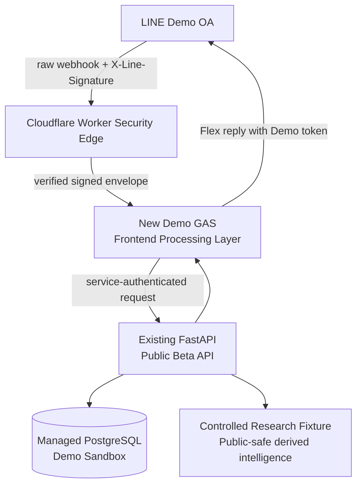

# R1B LINE Public Beta Sandbox Architecture

Date: 2026-08-30

Status: **LINE_PUBLIC_BETA_READY_FOR_MANUAL_SETUP / NOT DEPLOYED**

## Purpose

R1B turns the controlled research application into an isolated LINE public-beta sandbox for
portfolio demonstrations. It does not enable current-market F7 inference, price direction,
validated Chinese sentiment or brokerage integration.

## Private and Public Beta separation

| boundary | PRIVATE | PUBLIC BETA |
|---|---|---|
| LINE OA | Existing private OA | A new Demo LINE OA |
| LINE credentials | Private properties only | New Demo credentials only |
| GAS | Existing private original, frozen | New project from `line_adapter/public_beta/` |
| holdings | Private Sheet/private functions | Dedicated sandbox PostgreSQL tables |
| identity | Legacy private behavior | Edge-derived `dp_<HMAC-SHA256>` principal |
| research | Private features where configured | Controlled public-safe fixture only |
| providers | Private configuration | No Yahoo/FinMind/TWMD/Gemini/Perplexity calls |
| data lifecycle | Private policy | 30-day expiry plus self-delete |

The authoritative private files `/Users/xander/Desktop/code.gs`,
`/Users/xander/Desktop/appsscript.json`, the ignored immutable backup and migration copy are not
inputs to this release artifact and must not be deployed or modified.

## Architecture



### Security Edge

Cloudflare Worker is the single primary edge implementation because it preserves raw bytes and
headers, supports Web Crypto, provides HTTPS, and can remain a very small verifier/forwarder. It:

1. limits webhook payload size;
2. computes LINE HMAC-SHA256 over the exact raw body and timing-safely compares the Base64 result;
3. derives a stable `dp_` principal with a separate keyed HMAC;
4. never forwards or logs the raw LINE user ID;
5. normalizes only follow/text/postback events;
6. signs a five-minute envelope and forwards it to the new Demo GAS URL;
7. returns sanitized errors.

### Demo GAS

GAS remains the LINE Frontend Processing / Orchestration Layer. The independent public-safe source
is under `line_adapter/public_beta/`. It verifies the edge envelope, freshness, nonce, schema and
principal format; manages user-scoped 15-minute CacheService conversation state; parses inputs;
requires preview/confirmation; calls FastAPI; builds modular Flex messages; and replies through the
Demo LINE channel. It stores no portfolio truth and contains no provider or private resource ID.

### FastAPI

The existing backend is extended under `/api/v1/demo`. It authenticates the Demo GAS service before
accepting the derived principal, validates the frozen ticker universe and numeric ceilings, limits
users to five holdings, enforces optimistic versions and transaction-backed idempotency, assembles
controlled research/intelligence output, expires data and performs user-scoped deletion.

`X-User-ID` remains a development-only legacy contract and is not used by R1B.

### Storage

The deployment target is one small managed PostgreSQL database. Dedicated `demo_*` tables provide
transactions, unique idempotency keys, ownership filtering, expiry and cascade deletion. GAS Script
Properties are never used as the portfolio database. SQLite remains suitable only for local tests,
not cloud persistence.

## Identity and privacy

After LINE signature verification, the edge derives:

```text
demo_principal_id = "dp_" + HMAC_SHA256(DEMO_IDENTITY_SECRET, raw_line_user_id)
```

Only the derived principal crosses the edge. R1B does not call the LINE Profile API and does not
store display name, avatar, email, phone, brokerage identifier, screenshot or raw LINE user ID.
Every database lookup and mutation includes the trusted principal boundary.

## Portfolio lifecycle

1. A user accepts the short Demo disclosure.
2. GAS collects ticker, shares and average cost in expiring state.
3. GAS shows a preview; nothing is written yet.
4. A confirmation postback uses LINE `webhookEventId` as the idempotency key.
5. FastAPI validates ownership/universe/limits and commits holding plus idempotency record in one
   transaction.
6. Updates and deletes require the current holding version and another explicit confirmation.
7. A meaningful write extends expiry by 30 days.
8. `DELETE /api/v1/demo/me` removes the principal, holdings, preferences, pending backend records and
   audit rows by cascade. GAS also clears its temporary state.
9. `financial-ai-demo-cleanup` is ready for a deployment scheduler. Until configured, status is
   `READY_FOR_SCHEDULE_CONFIGURATION`, not automatically running.

## Research and price boundary

- Frozen universe is loaded from `research/configs/risk_market_dataset.v1.json`, not redefined.
- The existing synthetic 2330 controlled fixture is the only scored public-beta fixture.
- Other frozen tickers are accepted as sandbox holdings but explicitly abstain from research scores.
- No current price is shown and no ROI is calculated.
- Current-market F7 remains disabled: exact feature parity 5/23, gates 6/9, F11B-2 blocked.
- Chinese P/N/N stays null and the UI states that independent validation is incomplete.
- Market-reaction magnitude is historical association only, without direction or causality.

## Rate, abuse and error boundary

The API defaults to five holdings, 30 commands per principal per minute, 300 global commands per
minute, bounded numeric inputs and strict schemas. Edge body and message lengths are bounded. GAS
and backend errors shown to LINE are sanitized; stack traces, SQL, paths, hosts, tokens and provider
payloads are never returned.

## Rollback isolation

Disable in this order: LINE Demo webhook, Demo channel token, Worker route, Demo GAS deployment,
FastAPI public-beta service, then sandbox database if deletion is required. None of these actions
touch the Private LINE OA or private GAS project.

## Authoritative platform references

- [LINE webhook signature verification](https://developers.line.biz/en/docs/messaging-api/verify-webhook-signature/)
- [Cloudflare Workers Web Crypto](https://developers.cloudflare.com/workers/runtime-apis/web-crypto/)
- [Cloudflare Workers secrets](https://developers.cloudflare.com/workers/configuration/secrets/)
- [Cloudflare signed-request example](https://developers.cloudflare.com/workers/examples/signing-requests/)
- [Apps Script Web Apps](https://developers.google.com/apps-script/guides/web)
