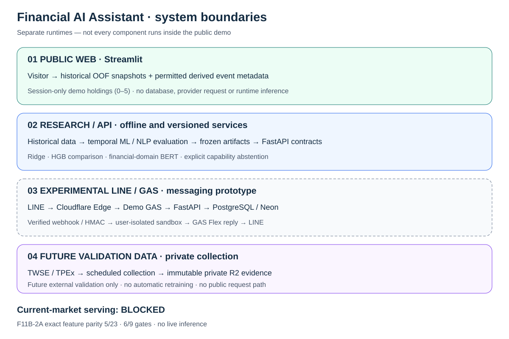
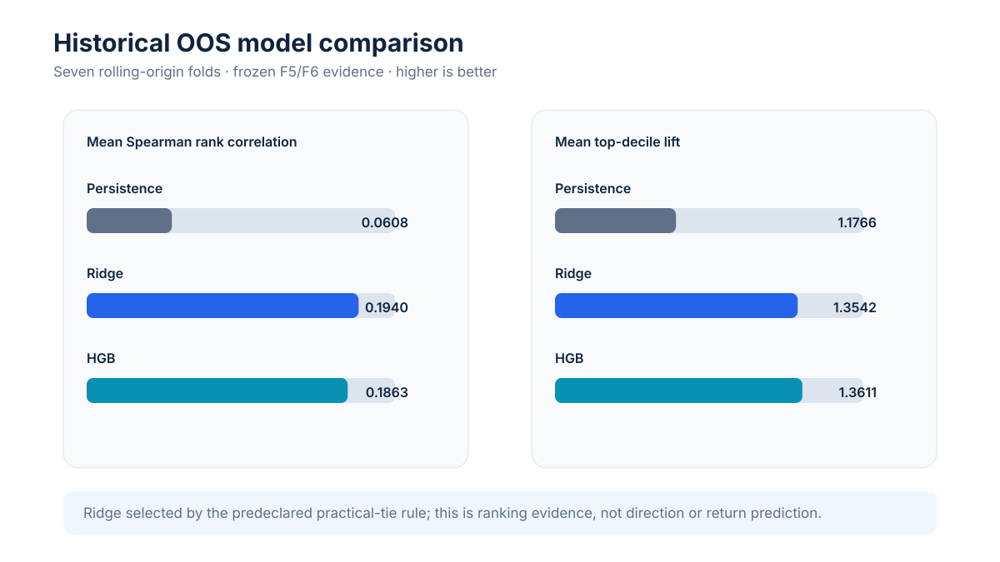
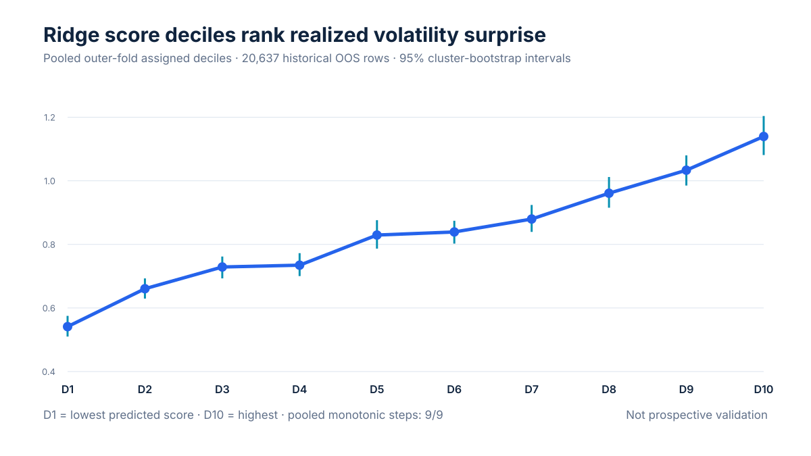
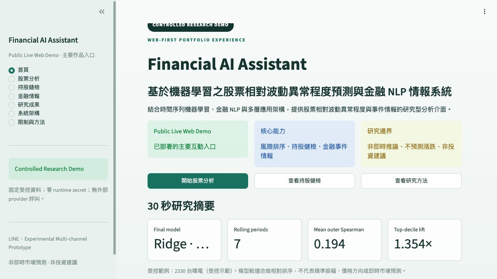

# Financial AI Assistant — Portfolio Guide

Finalized: 2026-08-30
Status: **research portfolio complete; Web-first controlled demo deployed**

## 1. Project in one sentence

Financial AI Assistant combines leakage-aware Taiwan-equity volatility-surprise forecasting with
abstention-safe financial NLP intelligence. The deployed Streamlit Web Demo is the primary public
experience; FastAPI and LINE/GAS remain reproducible integration layers.

The system does **not** predict price direction, issue buy/sell advice, guarantee future volatility
or claim validated Chinese linguistic sentiment.

## 2. Research story

The project began with a binary `HIGH_RISK / NORMAL` formulation. Strict temporal evaluation then
showed that classifier behavior depended materially on threshold and historical volatility regime.
The M9 conditional analysis further showed a Simpson-type composition effect: stock-relative,
normalized volatility surprise was more stable than an unconditional absolute-volatility story.

The final study therefore forecast a continuous target:

```text
next-session absolute adjusted-close log return
------------------------------------------------
20-session stock volatility known at session t
```

The final protocol used seven rolling-origin outer periods, inner temporal model selection and
fold-local preprocessing. It preserved the earlier binary work as exploratory problem-formulation
evidence rather than deleting or relabeling it as failure.

## 3. System architecture



### Ownership boundary

- **Python/FastAPI:** feature contracts, Track A inference, Track B intelligence, portfolio rules,
  persistence, lineage, authorization and abstention rules.
- **Streamlit:** primary public controlled experience with fixture-only analysis and a non-persistent
  browser-session portfolio sandbox (maximum five holdings).
- **LINE/GAS:** experimental multi-channel prototype demonstrating secure webhook handling,
  orchestration, Flex rendering and isolated sandbox persistence. It is not the primary CTA.
- **Current-market serving:** remains blocked because F11B-2A proved only 5/23 exact feature parity.

## 4. Track A — Volatility-surprise forecasting

### Dataset and evaluation

- Frozen universe: ten Taiwan-listed instruments.
- Final eligible historical rows: 32,357.
- Historical OOS evaluation rows: 20,637 across seven chronological outer folds.
- Predictors: exact ordered 23-feature `risk-features-v1` contract.
- Final model: Ridge Regression, `alpha=100`, selected by a rule frozen before final selection.
- Artifact: safe JSON; no pickle; not deployed.



| model | mean outer Spearman | mean outer MAE | worst-fold Spearman | top-decile lift |
|---|---:|---:|---:|---:|
| Persistence | 0.0608 | 0.7274 | 0.0080 | 1.1766 |
| Ridge | **0.1940** | **0.5473** | 0.1091 | 1.3542 |
| HGB | 0.1863 | 0.5480 | **0.1349** | **1.3611** |

Ridge and HGB were within the frozen 0.01 Spearman practical-tie margin. Ridge was selected by the
first applicable tie-break: lower mean outer MAE. This is not a claim that Ridge is universally
superior.



The pooled Ridge deciles rose from a mean realized target of 0.5413 in D1 to 1.1395 in D10, with
9/9 non-decreasing adjacent steps. The defensible interpretation is modest historical ranking
information. Mean point-forecast R² was near zero, so exact future magnitude prediction is not
claimed.

## 5. Track B — Financial NLP intelligence

Track B deliberately separates concepts that are often incorrectly collapsed:

- linguistic sentiment;
- event class;
- market-reaction magnitude;
- financial-domain representation;
- media tone proxy.

### Supported result

- 2021–2025 controlled private TWMD backfill: 7,582 events, 3,433 aggregated reaction windows and
  nine represented tickers.
- Metadata-only absolute-reaction model: OOF Spearman 0.2504; top-decile lift 1.623.
- Maturity: `AUTOMATED_SIGNAL_ONLY` — a historical association signal, not validated direction or
  causal impact.

### Negative and abstained results retained

- Signed-reaction Spearman: market-only 0.0349, metadata-only 0.0784, BERT text + metadata 0.0408.
- Frozen BERT text added no robust signed-reaction value; text-minus-metadata was negative in every
  fold.
- Chinese linguistic sentiment remains
  `ABSTAIN_CHINESE_SENTIMENT_NOT_VALIDATED`; all polarity probabilities remain null.
- Direction remains `ABSTAIN_DIRECTION_NOT_SUPPORTED`.
- English FinBERT remains a pinned, eligible capability, but controlled fixtures never pretend an
  unexecuted model was scored.
- eLAND remains permanently excluded from active modeling.

## 6. Product demonstrations

### Streamlit — primary public controlled demo



The current public fixture uses ticker-specific historical Track A OOF snapshots and permitted
metadata-derived Track B summaries. It is **not current-market inference** and does not turn one
ticker's result into another's. The Web Demo supports 0–5 browser-session holdings without login or
persistence; 0050 intentionally demonstrates a fail-closed missing-event state, and no current ROI
is calculated.

Additional screenshots:

- [Stock analysis](assets/public_web_demo_stock_analysis.png)
- [Portfolio health](assets/public_web_demo_portfolio_health.png)
- [Financial intelligence](assets/public_web_demo_intelligence.png)
- [Research results](assets/public_web_demo_research.png)
- [System architecture page](assets/public_web_demo_architecture.png)
- [Mobile viewport check](assets/public_web_demo_mobile.png)

### FastAPI — local research contract

- `GET /health`
- `POST /api/v1/research/volatility-surprise/predict`
- `GET /api/v1/research/intelligence/{ticker}`
- controlled LINE demo route protected by local service authentication

The research endpoints validate versions and lineage. They do not perform live provider, LLM or
model calls during ordinary request handling.

### LINE/GAS — experimental integration evidence

The six frozen product entries are 股票分析、持股健檢、金融情報、匯入持股、新聞研究、設定。
The isolated public-beta path demonstrates LINE OA → Cloudflare security edge → Demo GAS →
FastAPI → Neon → Flex Message. R1B-UX1 is prototype-complete and preserved, but additional LINE UX
or LIFF verification is no longer required for portfolio freeze. Private GAS, LINE, sheets and
holdings remain untouched.

## 7. F11B-2A current-market result

Current official OHLCV coverage is not the same as serving parity.

- TWSE current OHLCV covered 10/10 frozen tickers and all required recent 35 sessions.
- 0050 was available through 2026-08-28 from TWSE; its earlier missing day was a candidate-provider
  freshness problem.
- TAIEX total-return benchmark matched TWSE exactly on 20/20 current overlap sessions.
- Historical training used Yahoo `indicators.adjclose`; audited official corporate-action data did
  not prove an equivalent historical adjusted-price reconstruction.
- Raw source rows also differed.
- Exact feature parity: **5/23 PASS**.
- Gate status: **6/9 PASS**, decision
  `OFFICIAL_OHLCV_AVAILABLE_BUT_ADJUSTED_PARITY_UNRESOLVED`.

Therefore current-market integration remains `NOT_READY_FOR_F11B_2`. No gate was lowered, no model
was changed and no stale fallback was introduced. The controlled demo remains valid.

## 8. Install and run locally

Requirements: Python 3.12 and Git.

```bash
python3.12 -m venv .venv
source .venv/bin/activate
python -m pip install --upgrade pip
python -m pip install -e ".[dev,demo]"
```

Create `.env` only if local settings are required. Never commit it.

### FastAPI

```bash
python -m uvicorn backend.app.main:app --reload
curl http://127.0.0.1:8000/health
```

### Controlled Streamlit dashboard

```bash
python -m streamlit run demo/app.py
```

Keep the default **受控離線示範** mode for a network-free portfolio presentation. The optional API
mode accepts loopback origins only.

### Validation

```bash
python -m pytest -q
ruff check .
python scripts/check_secrets.py
git diff --check
```

## 9. Research integrity and limitations

- Retrospective, leakage-aware and hypothesis-informed; not prospective or independent external
  validation.
- Historical data informed the problem formulation; no historical period is relabeled as a new
  pristine sealed test.
- Ten-ticker universe limits market-wide generalization.
- Coverage exclusions have documented temporal concentration.
- Track A supports ranking more strongly than exact magnitude prediction.
- Track A does not predict up/down direction or return.
- Track B reaction magnitude is observational and not causal.
- Chinese linguistic sentiment explicitly abstains.
- BERT representation capability is separate from predictive incremental value.
- Licensed/private source records, holdings, screenshots, credentials and private GAS are excluded
  from public Git.
- Current-market inference remains gated; all public product examples are controlled fixtures.
- The system is research software, not investment advice.

## 10. Evidence map

| topic | authoritative evidence |
|---|---|
| Final research protocol | [F1 protocol](final_volatility_surprise_study_protocol.md) |
| Dataset and feature audit | [F3 result](../research/evaluation/f3_target_feature_coverage_audit_result.md) |
| Temporal evaluation | [F5 result](../research/evaluation/f5_nested_temporal_evaluation_result.md) |
| Ranking and robustness | [F6 result](../research/evaluation/f6_ranking_robustness_result.md) |
| Final model freeze | [F7 result](../research/evaluation/f7_final_research_model_result.md) |
| NLP integration | [B5 result](../research/evaluation/b5_nlp_intelligence_integration_result.md) |
| Dashboard | [F11A result](../research/evaluation/f11_dashboard_demo_result.md) |
| LINE controlled demo | [F11B-1B design](f11b_controlled_line_demo.md) |
| Current-market gate | [F11B-2A result](../research/evaluation/f11b_official_current_market_parity_result.md) |
