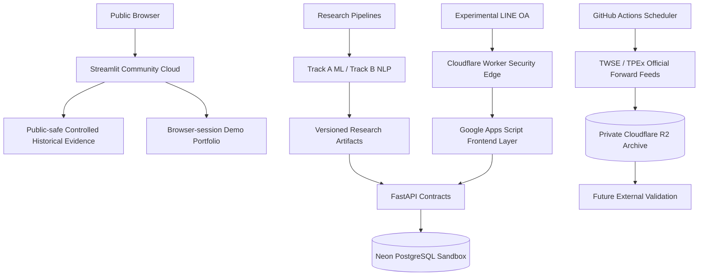

# Financial AI Assistant：專案介紹、目前狀態與技術總覽

文件日期：2026-09-04（Asia/Taipei）

專案版本：`v1.0.0-portfolio`

Repository：`financial-ai-assistant`
主要公開展示：[Public Live Web Demo](https://mieuxwei-f6rbk4pvtvxs3rsh3k2zmn.streamlit.app/)

公開定位：**Independent ML & Financial NLP Research Project**

英文專案首頁：[README](../README.md)

已完成並凍結的 v1.0 研究、公開受控歷史展示、實驗性 LINE／GAS 整合、停用中的即時市場推論，
以及供未來外部驗證的資料收集，是五個不同狀態。未來驗證不代表 v1.0 尚未完成，也不代表
已取得外部驗證結果。本文的部署／資料收集數字是下方註明時間的紀錄，不是即時監控。

公開 Demo 使用 ticker-specific historical OOF 快照與允許公開的衍生事件 metadata，並非合成行情、
即時新聞或 request-time 模型推論。只有使用者可編輯的 Demo 持股股數／成本是示範輸入，
最多五檔、僅存於瀏覽工作階段，不接真實帳戶、不計算即時 ROI。0050 有股票研究快照，
但缺少可公開事件，維持不補造的狀態。

若免費 Streamlit 頁面休眠，依頁面提示喚醒並稍候；[README 截圖](../README.md#research-results)可作備援。

> 本文件以目前 repository、v1.0 release evidence 與部署狀態為準。文中會明確區分
> 「已完成」、「實驗性原型」與「尚未通過驗證」的功能，避免把研究計畫或受控展示誤稱為
> 即時產品能力。

## 1. 專案簡介

Financial AI Assistant 是一套以台灣股票市場為主的研究型金融情報系統，結合：

- 股票價格、成交量、波動與市場情境特徵；
- 時間序列機器學習與 leakage-safe 評估；
- 中英文金融 NLP、事件分類與市場反應研究；
- FastAPI、PostgreSQL、Streamlit、LINE、Google Apps Script 與 Cloudflare；
- 官方事件資料的長期 forward collection 與可追溯資料 lineage。

專案最終研究問題是：

> 能否使用在預測當下已知的價格、成交量、波動與市場情境特徵，預測下一交易日相對於該股票
> 自身歷史波動水準的波動異常程度？

系統研究的是 **stock-normalized volatility surprise（股票相對波動異常程度）**，不是預測股票
上漲或下跌，也不是報酬率、目標價或買賣建議。

## 2. 為什麼研究問題後來改變

專案最初研究的是二元分類：

```text
市場特徵 → HIGH_RISK / NORMAL
```

後續的 walk-forward、sealed-test、robustness、threshold 與 volatility-regime 分析發現：

1. 二元結果對分類門檻相當敏感；
2. precision 與 recall 存在明顯取捨；
3. 不同歷史波動 regime 的操作結果不穩定；
4. 未條件化的絕對波動比較會受到樣本組成影響；
5. 相對於個股自身歷史波動基準的連續 outcome 較一致。

因此，舊二元研究沒有被刪除或描述為失敗，而是保留為 **Exploratory Research / Problem
Formulation Evidence**。最終研究改為：

```text
市場與技術特徵
  → 連續 volatility-surprise score
  → historical percentile
  → LOW / MODERATE / HIGH / VERY HIGH 溝通分級
```

上述分級只是方便使用者理解的 communication band，不是價格方向分類。

## 3. 核心研究設計

### 3.1 Track A：股票相對波動異常程度預測

主要 target 概念為：

```text
下一交易日 adjusted-close 絕對 log return
────────────────────────────────────────────
feature session t 當下可知的 20-session 個股歷史波動
```

所有 predictor 都只能使用 information cutoff 以前的資訊。研究禁止 random split，並採用：

- 7 個 chronological rolling-origin outer periods；
- outer training history 內的 inner temporal model selection；
- 每個 fold 個別 fit preprocessing；
- out-of-fold（OOF）預測；
- ticker、年份、fold 與 volatility regime robustness analysis；
- regression 與 ranking 指標並行評估。

### 3.2 Track B：Financial NLP Intelligence

Track B 不把所有概念混成單一「情緒分數」，而是分開處理：

- `LINGUISTIC_SENTIMENT`：文字語氣的正面／中立／負面；
- `EVENT_CLASS`：事件屬於增資、併購、重大契約等哪一類；
- `MARKET_REACTION_MAGNITUDE`：歷史上類似事件後續價格反應幅度；
- `FINANCIAL_DOMAIN_REPRESENTATION`：金融語料的 embedding／representation；
- `MEDIA_TONE`：若來源可用時的媒體語調 proxy。

市場報酬不是語言情緒 ground truth，event class 也不是 sentiment。中文 linguistic sentiment
因缺乏通過獨立驗證的 P/N/N ground truth，目前採明確 abstention。

## 4. 研究資料與結果

### 4.1 Track A 資料規模

- 固定 10 檔台股／ETF；
- 40,691 筆歷史個股 OHLCV rows；
- 4,080 個 TAIEX benchmark sessions；
- 32,357 筆符合 frozen target/feature contract 的 final rows；
- 20,637 筆 unique historical OOS evaluation rows；
- exact frozen feature contract：23 個特徵。

特徵群包含：

- lagged return 與多期 momentum；
- volume change、rolling volume statistics、abnormal volume；
- trailing volatility、high-low range、ATR 類 proxy；
- moving-average distance、RSI、MACD 等精簡技術指標；
- TAIEX return、TAIEX volatility 與 stock-minus-market context。

### 4.2 Track A 模型比較

| 模型 | Mean outer Spearman | Mean outer MAE | Worst-fold Spearman | Top-decile lift |
|---|---:|---:|---:|---:|
| Persistence baseline | 0.0608 | 0.7274 | 0.0080 | 1.1766 |
| Ridge Regression | **0.1940** | **0.5473** | 0.1091 | 1.3542 |
| HistGradientBoosting | 0.1863 | 0.5480 | **0.1349** | **1.3611** |

Ridge 與 HistGradientBoosting 落在預先凍結的 0.01 Spearman practical-tie margin 內。依事前規則，
Ridge 依序比較後因平均 MAE 較低而獲選；並不代表全面優於 HGB。最終模型為：

```text
Ridge Regression, alpha = 100
```

平均 R² 接近零／略為負值，因此正確結論是：模型具有 **有限但可重現的歷史排序訊號**，較適合
把樣本由低到高排序，不適合宣稱能精準預測下一日波動數值。

### 4.3 Track B 結果

Track A 與 Track B 的研究問題、target、樣本及評估協議不同，兩組 Spearman 不能直接比較誰更好。

- 私有授權的 2021–2025 研究資料：7,582 events；
- 聚合後：3,433 個 ticker-reaction windows；
- 涵蓋：9 檔股票；
- metadata-only absolute-reaction OOF Spearman：**0.2504**；
- top-decile lift：**1.623**；
- signed direction evidence 弱，不提供可靠上漲／下跌預測；
- BERT text 未對 metadata baseline 帶來穩健的 signed-reaction incremental value；
- FSC-adapted BERT-base-Chinese 保留為金融領域 representation，不宣稱可預測報酬方向；
- 中文情緒維持 `ABSTAIN`，不輸出虛假的 Positive／Neutral／Negative 機率；
- eLAND 已排除於 active modeling，只保留歷史資料稽核與拒絕紀錄。

## 5. 系統架構



### 5.1 主要公開體驗

```text
Browser → Streamlit → 受控歷史研究快照 + browser-session portfolio
```

公開 Web Demo：

- 不需登入；
- 不保存使用者持股；
- 不載入私人模型或授權 raw data；
- 不需要 runtime secret；
- 不在 request time 呼叫 Yahoo、FinMind、TWMD、Gemini、Perplexity 或其他 provider；
- 不執行 current-market inference。

### 5.2 FastAPI 與資料庫路徑

FastAPI 負責版本化 API contract、identity-bound service、portfolio rules、資料驗證、研究 intelligence
與 abstention boundary。SQLAlchemy 負責 persistence abstraction，Alembic 管理 schema migration，
正式 sandbox 使用 Neon PostgreSQL；SQLite 僅用於本機測試。

### 5.3 Experimental LINE / GAS 路徑

LINE 是多通路整合原型，不是作品集的主要入口：

```text
LINE Demo OA
  → Cloudflare raw-body signature verification
  → HMAC-derived demo principal
  → Demo Google Apps Script routing / Flex rendering
  → service-authenticated FastAPI
  → Neon sandbox portfolio
```

GAS 保留 webhook orchestration、輸入流程、短期 conversation state 與 Flex Message rendering；
FastAPI 保有 portfolio truth、transaction、idempotency、authorization 與 persistence。raw LINE user ID
不作為 application primary key，也不應持久化。

### 5.4 Forward data collection

官方 TWSE／TPEx 重大訊息由 GitHub Actions 每日執行三次 reconciliation：

| 階段 | Asia/Taipei 目標時間 | UTC cron |
|---|---:|---:|
| `next_morning` | 08:00 | `0 0 * * *` |
| `current` | 16:30 | `30 8 * * *` |
| `evening` | 21:30 | `30 13 * * *` |

資料使用 raw-first、immutable object、SHA-256 lineage、source manifest、overall run manifest 與
same-run-id idempotency，保存至 private Cloudflare R2。收集程序只保存資料，不會自動重訓、驗證
或升級模型。

## 6. 目前專案狀態

### 6.1 Release 狀態

| 項目 | 目前狀態 |
|---|---|
| Portfolio release | `V1_0_PORTFOLIO_FROZEN` |
| Git tag | `v1.0.0-portfolio` |
| Track A | `COMPLETE / FROZEN` |
| Track B | `COMPLETE THROUGH B5` |
| Public Web Demo | 已部署，主要公開體驗 |
| FastAPI foundation | 完成；實驗 LINE sandbox 使用部署版本 |
| LINE / GAS | 已部署的 experimental multi-channel prototype |
| LIFF multi-holding editor | Prototype complete；不是主要作品入口 |
| Current-market F7 inference | **Disabled / Blocked** |
| Chinese linguistic sentiment | **ABSTAIN / 未通過獨立驗證** |
| Forward TWSE／TPEx collection | 已部署、持續執行 |
| Automatic retraining | `false` |

### 6.2 Current-market serving 限制

官方 current OHLCV 可以覆蓋固定 10 檔股票，TAIEX benchmark 也可對齊，但 historical training
使用的是 Yahoo `adjclose` 語義。現有官方 corporate-action lineage 尚無法證明能重建與 training
完全等價的 adjusted-price series，因此：

- exact feature parity：**5/23**；
- serving readiness gates：**6/9**；
- F11B-2 current-market integration：**BLOCKED**；
- 系統不得以 Yahoo silent fallback 或改 feature contract 的方式假裝通過。

公開畫面因此使用「受控歷史研究快照」，而不是「今日／即時 AI 預測」。

### 6.3 最新 forward collection 健康狀態

檢查時間：2026-09-04 00:19（Asia/Taipei）。

- GitHub Actions workflow executions：13 次；
- 其中正式 scheduled runs：11 次；
- scheduled success：11；
- scheduled failure：0；
- in-progress：0；
- 最新 run：`33758080435`；
- 最新 run 於 2026-09-03 20:55（Asia/Taipei）啟動，20:58 完成；
- TWSE／TPEx 最近可核對的 manifest summary 皆為兩個來源成功；
- `automatic_retraining=false`；
- 沒有觀察到 live schema drift 或 model execution。

GitHub Actions cron 不是秒級保證，近期曾有約 2–4 小時啟動延遲。這不等同資料收集失敗，但第 7 天
health audit 應檢查 run count、last success、來源 rows、missingness、duplicates、schema drift、R2
object count 與 manifest consistency。公開 workflow summary 不揭露完整累積資料筆數，因此本文件
不臆測 R2 內的總 rows。

## 7. 實際應用的技術

| 層級 | 技術 | 在本專案中的用途 |
|---|---|---|
| 語言 | Python 3.12 | 資料處理、ML/NLP、API、jobs、測試 |
| Web frontend | Streamlit | Public controlled research dashboard、股票分析、持股健檢、金融情報 |
| Backend API | FastAPI、Uvicorn、Pydantic | Versioned API、schema validation、health、research/portfolio services |
| ORM / migration | SQLAlchemy、Alembic | Repository pattern、transaction、資料庫 schema migration |
| Database | PostgreSQL / Neon | Experimental LINE sandbox 的隔離持股、idempotency 與 lifecycle |
| Local test DB | SQLite | 本機與自動測試，不作為正式 cloud persistence |
| Machine learning | scikit-learn | Ridge、HistGradientBoosting、Logistic Regression、Random Forest、scaling |
| NLP runtime | PyTorch、Hugging Face Transformers | FinBERT、BERT-base-Chinese／MacBERT feasibility 與 domain adaptation |
| English NLP | ProsusAI/finbert | 經 pinned revision 的英文金融情緒研究流程 |
| Chinese NLP | FSC-adapted BERT-base-Chinese | 金融領域 representation；不是已驗證 sentiment classifier |
| Research validation | Rolling-origin、nested temporal validation、OOF | 避免 random split 與時間洩漏，評估跨時期穩健性 |
| Metrics | MAE、RMSE、R²、Spearman、decile lift | 同時評估數值誤差與排序能力 |
| Market research data | Yahoo historical adapter、FinMind TAIEX | 歷史 adjusted-price research 與 benchmark；不是公開 Demo 即時來源 |
| Official event data | TWSE、TPEx | 重大訊息 ingestion、事件時間與 forward collection |
| Licensed secondary data | TWMD | 私有 Track B event metadata research；raw licensed rows 不公開 |
| Regulatory corpus | FSC 6,021-record corpus | 中文金融領域適應與 representation research |
| Messaging | LINE Messaging API、Flex Message、LIFF | Experimental multi-channel UI 與 sandbox portfolio prototype |
| Frontend orchestration | Google Apps Script | LINE routing、conversation state、FastAPI 呼叫與 Flex rendering |
| Security edge | Cloudflare Workers / Web Crypto | Raw LINE signature verification、HMAC principal、signed envelope |
| Object storage | Cloudflare R2 | 私有 immutable raw/normalized event archive 與 manifest lineage |
| Backend hosting | Vercel | Experimental FastAPI / LIFF deployment |
| Demo hosting | Streamlit Community Cloud | 主要公開 HTTPS 作品展示 |
| Scheduling / CI | GitHub Actions | 三次每日 forward collection、CI 與 manual dispatch |
| Quality assurance | pytest、Ruff、secret scan、`git diff --check` | Regression、lint、credential leakage 與 patch hygiene |
| Reproducibility | JSON configs、SHA-256、run manifests | Dataset、feature、model、evaluation 與 collection lineage |
| Container/local infra | Docker Compose | 本機服務與資料庫開發環境 |

## 8. 從原始 GAS 股票助手保留的產品概念

專案起點是 Google Apps Script + LINE 股票助手，曾包含：

- LINE `doPost`、follow/text/image event routing；
- Google Sheets 持股保存；
- Yahoo 價格、日漲跌、MA5、MA20 與 ROI；
- 券商截圖透過 Gemini 解析持股；
- Perplexity on-demand 新聞研究；
- 晨報、收盤報與 Apps Script triggers；
- Flex Message、錯誤處理與 quota infrastructure。

這些經驗形成後續架構設計，但沒有全部直接搬進公開版。重構原則是：

- **GAS 縮成 thin frontend adapter**；
- **Python/FastAPI 負責商業規則、資料、ML/NLP 與持久化**；
- **公開 Web Demo 不接私人 Sheets、Gemini 或 Perplexity**；
- **Screenshot import 因隱私與 provider boundary，不在 public beta core 啟用**；
- **新聞研究不得輸出買進、賣出、目標價或保證性建議**。

因此，Gemini 與 Perplexity 屬於私人 legacy capability／未來可選研究工具，不是目前 Public Web
Demo 的 runtime dependency。

## 9. 安全、隱私與研究誠信

本專案採用的保護措施包括：

- `.env`、credentials、private GAS、持股、screenshots 與 raw licensed data 不進 Git；
- Public Web Demo 為 zero-runtime-secret、zero-request-time-provider-call；
- LINE webhook 在 Cloudflare Edge 驗證原始 request body 與 `X-Line-Signature`；
- raw LINE user ID 經 keyed HMAC 轉為 stable demo principal；
- Edge → GAS 與 GAS → FastAPI 使用獨立 service authentication；
- portfolio mutation 使用 preview/confirm、transaction 與 idempotency；
- 每位 LINE sandbox user 的 holdings 與設定以 principal 隔離；
- private TWMD raw rows、publisher full text 與私人 R2 archive 不公開；
- 中文情緒與市場方向在證據不足時 fail closed／abstain；
- 研究不宣稱 causal impact、prospective validation 或交易獲利能力。

## 10. 目前可展示的功能

### Public Web Demo

- 10 檔 ticker-specific Track A 受控歷史快照；
- 9 檔具 public-safe metadata-derived event summary；
- 0050 保留 event unavailable 的 fail-closed 示例；
- volatility-surprise score、historical percentile 與 communication band；
- browser-session 0–5 檔 Demo portfolio；
- 股票新增、修改、刪除與持股健檢；
- event class、historical reaction magnitude 與 sentiment limitation；
- Track A／Track B 成果圖表、方法、架構與限制。

### Experimental LINE Prototype

- LINE Demo OA 與 Rich Menu；
- 安全 webhook edge；
- GAS routing 與 Flex Messages；
- FastAPI + Neon sandbox holdings；
- multi-user isolation、idempotent writes、30-day retention 與 delete-my-data；
- LIFF multi-holding editor prototype。

## 11. 尚未啟用或刻意排除的能力

- 即時／當日 F7 model inference；
- 股票漲跌方向、報酬率與目標價預測；
- 買進／賣出建議；
- 已驗證的中文 Positive／Neutral／Negative sentiment；
- BERT 改善股價方向預測的宣稱；
- request-time Yahoo、FinMind、TWMD、Gemini、Perplexity 或 LLM call；
- 自動模型重訓與自動 promotion；
- eLAND active modeling；
- 將 private Google Sheet、私人持股或 broker screenshot 接入公開服務。

## 12. 專案目前的限制

1. Track A 的主要價值是 historical ranking，而非精準 magnitude prediction；
2. universe 只有 10 檔，泛化能力有限；
3. 研究是 retrospective、leakage-aware、hypothesis-informed，不是未觸碰的 prospective test；
4. current serving 的 adjusted-price lineage 與 exact feature parity 尚未通過；
5. 中文情緒沒有可接受的獨立 ground truth；
6. Track B market-reaction magnitude 是 observational association，不是因果關係；
7. TWMD 與部分來源受授權限制，公開展示只能使用允許的衍生 metadata；
8. GitHub Actions 排程可能延遲，需依 manifest 而不是預定時間判斷完成狀態；
9. repository 尚未授予 repository-wide source-code license；公開可見不等於可自由重用。

## 13. 下一階段

v1.0 已完成並凍結。現在不需要重開模型研究，合理的後續工作是：

1. 繼續累積部署後自然形成的 TWSE／TPEx forward observations；
2. 部署滿 7 天後執行第一次 collection health audit；
3. 30 天後檢查 coverage、missingness、duplicates、schema stability 與 storage growth；
4. 約 3–6 個月後另開 v1.1 Future External Validation；
5. 使用真正 unseen future data 評估 frozen v1.0；
6. 只有在新證據支持時，才另外批准 retraining 或新模型版本。

```text
forward collection ≠ automatic retraining
external validation ≠ rewriting v1.0 history
new model candidate ≠ automatic production promotion
```

## 14. 一句話總結

Financial AI Assistant 不只是把金融 API 接到聊天機器人，而是完整實作了從資料治理、時間安全
特徵、rolling-origin ML 評估、金融 NLP 邊界、API 與資料庫、安全 webhook、多使用者 sandbox，
到公開作品集與未來外部驗證資料管線的一套研究型 Financial AI 系統。
