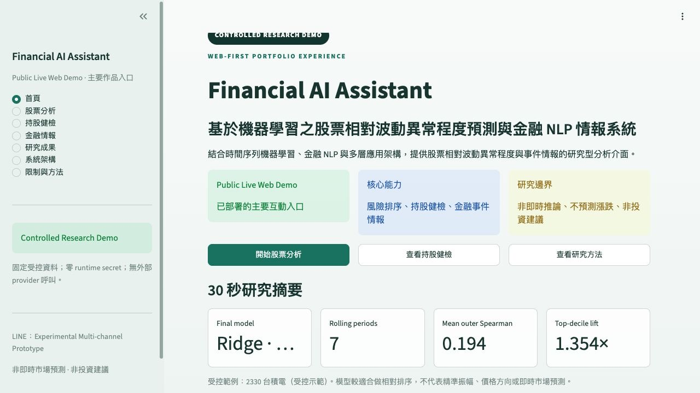

# R1A Public Web Demo Release

Date: 2026-08-29  
Status: **PUBLIC_WEB_DEMO_READY_FOR_MANUAL_DEPLOY**  
Public URL: [mieuxwei-f6rbk4pvtvxs3rsh3k2zmn.streamlit.app](https://mieuxwei-f6rbk4pvtvxs3rsh3k2zmn.streamlit.app/)

Current release note: the first cloud build exposed a nested-entrypoint import error; the local
correction is validated but must be committed/pushed before Cloud can redeploy it.

## 1. Release decision

Primary provider: **Streamlit Community Cloud**.

Topology:

```text
Public browser
  → Streamlit Community Cloud HTTPS
  → demo/public_app.py
  → repository-controlled synthetic fixture
  → read-only presentation
```

FastAPI is not part of the public topology. The public entrypoint has no provider, model, LLM,
portfolio, database or LINE request path. It does not require the ignored F7 model artifact.



## 2. Hosting audit

| provider | relevant capability | limitation / trade-off | R1A decision |
|---|---|---|---|
| Streamlit Community Cloud | Native Streamlit deployment, managed HTTPS, GitHub integration and Python 3.12 default | Requires the repository update to exist on GitHub and the owner to authorize repository access | **PRIMARY** |
| Render | General Python web service with managed TLS | Free service sleeps after 15 idle minutes; cold start and ephemeral filesystem add unnecessary operational behavior | Secondary fallback |
| Railway | General service deployment and public networking | Trial is time/credit bounded; free monthly credit is limited | Secondary fallback |
| Hugging Face Spaces | Public application hosting | Native Streamlit SDK was deprecated; current Streamlit path requires Docker | Not selected |

Official references:

- [Streamlit Community Cloud deployment](https://docs.streamlit.io/deploy/streamlit-community-cloud/deploy-your-app/deploy)
- [Streamlit dependency-file rules](https://docs.streamlit.io/deploy/streamlit-community-cloud/deploy-your-app/app-dependencies)
- [Streamlit Community Cloud limitations](https://docs.streamlit.io/deploy/streamlit-community-cloud/status)
- [Render free-service limitations](https://render.com/docs/free)
- [Railway free trial](https://docs.railway.com/pricing/free-trial)
- [Hugging Face Spaces Streamlit deprecation](https://huggingface.co/docs/hub/main/spaces-changelog)

## 3. Reproducible deployment settings

- Repository: `mieuxwei/financial-ai-assistant`
- Branch: `main`
- Entrypoint: `demo/public_app.py`
- Python: `3.12`
- Dependency file: `demo/requirements.txt`
- Secrets: **leave empty**
- Runtime storage: none
- Persistent database: none

Local smoke command:

```bash
python3.12 -m venv .venv
source .venv/bin/activate
python -m pip install -r demo/requirements.txt
python -m streamlit run demo/public_app.py
```

Community Cloud runs the entrypoint from the repository root and installs the dependency file next
to the entrypoint. No separate build command or backend start command is required.

## 4. Data and secret boundary

Packaged public inputs are limited to code, the deterministic synthetic fixture, safe lineage
identifiers and aggregate research evidence. Runtime secrets are zero.

Excluded from the public release:

- `.env` and `.streamlit/secrets.toml`;
- `.tools/`, including model/evaluation caches and `.tools/private`;
- raw or licensed TWMD records;
- holdings, cost basis, screenshots and personal data;
- LINE, Gemini, Perplexity, FinMind and other provider credentials;
- private GAS originals, immutable backup and migration copy.

The public entrypoint does not accept portfolio input, file uploads, arbitrary URLs or provider
credentials.

## 5. Claim boundary

The first viewport identifies the application as **Controlled Research Demo** and states that it is
not live market inference or investment advice.

- Track A output is relative volatility-surprise risk, percentile and communication band.
- It is not a price-direction or return forecast.
- Chinese linguistic sentiment remains unvalidated and abstains.
- Market-reaction magnitude is an automated historical-association signal, not direction or causal
  impact.
- BERT financial representation is not described as improving signed reaction prediction.
- F11B-2 remains blocked: 6/9 gates pass and exact current feature parity is 5/23.

## 6. Public runtime safety

- Fixture-only branch bypasses `_resolve_data` and never constructs the local FastAPI client.
- No request-time Yahoo, FinMind, TWMD, GDELT, Gemini, Perplexity, OpenAI, LINE or Google Sheets
  call exists in the public entrypoint.
- Streamlit client error details are set to `none`; toolbar is viewer-only; XSRF protection remains
  enabled.
- The app has no upload control, filesystem selector or arbitrary remote URL input.
- Streamlit Community Cloud may override telemetry settings as documented by the platform; the app
  itself emits no provider request.

## 7. Manual deployment steps

The public app URL now exists, but the corrected entrypoint has not been pushed. After review:

1. The user commits and pushes the validated `demo/public_app.py` correction.
2. In Streamlit Community Cloud, reboot/redeploy the existing app if it does not rebuild
   automatically from `main`.
3. Keep Python 3.12 and the secrets field empty.
4. Run the bounded HTTPS smoke test in section 8 before sharing the URL.

Repository administrator permission is required for the initial deployment authorization.

## 8. Post-deployment smoke test

Verify only:

1. HTTPS page returns successfully.
2. `Controlled Research Demo` appears above the fold.
3. Score, percentile and communication band render.
4. Controlled financial intelligence and market-reaction magnitude render.
5. Research evidence and limitations render.
6. Chinese sentiment remains human-readable abstention.
7. Current-market blocked explanation shows 6/9 and 5/23 in the detail view.
8. No stack trace, private data, secret or request-time provider call appears.

Do not perform load testing.

## 9. Rollback / disable

Use Streamlit Community Cloud app settings to make the app private or delete it. This disables the
public URL without changing Track A/B artifacts or GAS. If repository access is no longer needed,
revoke the Streamlit GitHub application separately after the app is disabled.
